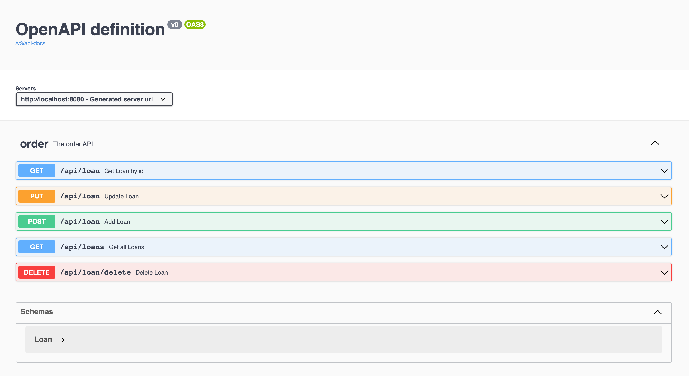

= DevOps Demo
:toc: manual

== What's this

This is demo for DevOps Webinar.

== Build and Run

[source, bash]
.*1. Build*
----
mvn clean install
----

Once build process complete, you will see the following outputs

[source, bash]
----
[INFO] Devops Loan Parent ................................. SUCCESS [  0.343 s]
[INFO] DevOps Loan API .................................... SUCCESS [  1.387 s]
[INFO] DevOps Loan Zookeeper .............................. SUCCESS [  0.936 s]
[INFO] DevOps Loan MongoDB ................................ SUCCESS [  0.364 s]
[INFO] DevOps Loan Provider ............................... SUCCESS [  0.657 s]
[INFO] DevOps Loan Consumer ............................... SUCCESS [  0.651 s]
----

*2. Run*

Run the Demo will start Zookeeper, MongoDB, Provider and Consumer accordingly.

[source, bash]
.*Zookeeper*
----
java -jar zookeeper/target/devops-loan-zookeeper-1.0.jar
----

[source, bash]
.*MongoDB*
----
docker run -itd --rm --name=mongodb -p 27017:27017 mongo:5.0.5
----

[source, bash]
.*Provider*
----
java -DDUBBO_REGISTRY_PROXY_ADDRESS=127.0.0.1 -DMONGODB_SERVER_ADDRESS=127.0.0.1 -jar provider/target/devops-loan-provider-1.0.jar
----

[source, bash]
.*Consumer*
----
java -DDUBBO_REGISTRY_PROXY_ADDRESS=127.0.0.1 -jar consumer/target/devops-loan-consumer-1.0.jar
----

Once all 4 microservice started, access http://localhost:8080/swagger-ui.html will go into swagger UI page.

[source, bash]
.*Generate some test*
----
curl -X 'POST' \
  'http://localhost:8080/api/loan' \
  -H 'accept: */*' \
  -H 'Content-Type: application/json' \
  -d '{
  "id": 101,
  "phone": "18688888888",
  "users": "Kylin"
}'

curl -X 'POST' \
  'http://localhost:8080/api/loan' \
  -H 'accept: */*' \
  -H 'Content-Type: application/json' \
  -d '{
  "id": 102,
  "phone": "18688888888",
  "users": "Zeze"
}'
----

== Run with Docker

[source, bash]
.*1. Build*
----
cd zookeeper/
docker build -t cloudadc/zookeeper:1.0 .
docker push cloudadc/zookeeper:1.0

cd provider/
docker build -t cloudadc/loan-provider:1.0 .
docker push docker.io/cloudadc/loan-provider:1.0

cd consumer/
docker build -t cloudadc/loan-consumer:1.0 .

----

Run the Demo will start Zookeeper, MongoDB, Provider and Consumer accordingly.

[source, bash]
.*Zookeeper*
----
docker run -it --rm --name=zookeeper cloudadc/zookeeper:1.0
----

[source, bash]
.*MongoDB*
----
docker run -it --rm --name=mongodb mongo:5.0.5
----

[source, bash]
.*Provider*
----
docker run -it --rm --name=loan-provider --link zookeeper --link mongodb cloudadc/loan-provider:1.0 
----

[source, bash]
.*Consumer*
----
docker run -it --rm --name=loan-consumer --link zookeeper -p 8080:8080 cloudadc/loan-consumer:1.0 
----

Once all 4 microservice started, access http://localhost:8080/swagger-ui.html will go into swagger UI page.

[source, bash]
.*Check the microserivce cpontainers*
----
$ docker ps
CONTAINER ID   IMAGE                        COMMAND                  CREATED          STATUS          PORTS                    NAMES
0eaf4bd8df54   cloudadc/loan-consumer:1.0   "java -jar devops-lo…"   3 minutes ago    Up 3 minutes    0.0.0.0:8080->8080/tcp   loan-consumer
34d065e51882   cloudadc/loan-provider:1.0   "java -jar devops-lo…"   8 minutes ago    Up 8 minutes    20880/tcp                loan-provider
f81aa0842734   mongo:5.0.5                  "docker-entrypoint.s…"   17 minutes ago   Up 17 minutes   27017/tcp                mongodb
1f76ad305c1e   cloudadc/zookeeper:1.0       "java -jar devops-lo…"   19 minutes ago   Up 19 minutes   2181/tcp                 zookeeper
----

== Deploy to K8S

[source, bash]
.*Deploy*
----
kubectl apply -f loan.yaml
----

[source, bash]
.*View the Deploment*
----
# kubectl get pods -n zookeeper --no-headers -o wide
zookeeper-598ffbcc8c-58rxv   1/1   Running   0     48m   10.244.1.128   node3

# kubectl get pods -n loan-db --no-headers -o wide
mongodb-6b95f4f959-4zvm6   1/1   Running   0     42m   10.244.1.129   node3

# kubectl get pods -n loan-provider --no-headers -o wide
provider-b75c56b9b-hb8rl   1/1   Running   0     11m   10.244.2.184   node2 
provider-b75c56b9b-qq5mx   1/1   Running   0     11m   10.244.1.134   node3

# kubectl get pods -n loan-consumer --no-headers -o wide
consumer-5d4b5b76fb-4clc2   1/1   Running   0     11m   10.244.2.185   node2 
consumer-5d4b5b76fb-ztgxx   1/1   Running   0     12m   10.244.1.135   node3

# kubectl get nodes -o wide --no-headers
master   Ready   master   130d   v1.18.17   192.168.200.205   <none>   CentOS Linux 7 (Core)   3.10.0-1062.el7.x86_64   docker://18.9.7
node2    Ready   <none>   130d   v1.18.17   192.168.200.207   <none>   CentOS Linux 7 (Core)   3.10.0-1062.el7.x86_64   docker://18.9.7
node3    Ready   <none>   46d    v1.18.17   192.168.200.212   <none>   CentOS Linux 7 (Core)   3.10.0-1062.el7.x86_64   docker://18.9.7
----

Once all 4 microservice started, access http://192.168.200.205:30036/swagger-ui.html will go into swagger UI page.

