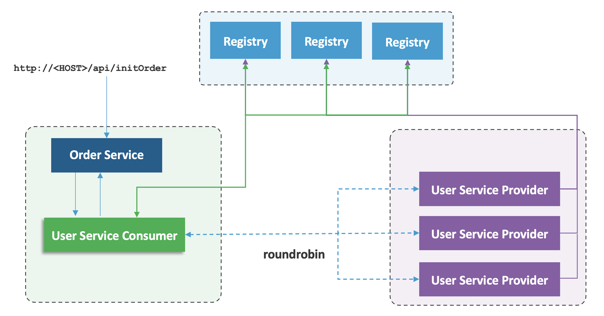

= Dubbo Sample
:toc: manual

== What's this

As above figure, the dubble sample contains 4 components:

* Registry - Zookeeper
* User Service Provider  - Dubbo Service Provider, which register the User Service to Zookeeper
* User Service Consumer  - Dubbo Service Provider, which will lookup Dubbo Service from Registry and consume the service
* Order Service - REST based service, which will invoke the User Service Consumer

[source, bash]
.*编译*
----
$ mvn clean install
...
[INFO] User Service Demo Parent ........................... SUCCESS [  0.249 s]
[INFO] User Service Demo API .............................. SUCCESS [  1.010 s]
[INFO] User Service Demo Provider ......................... SUCCESS [  0.739 s]
[INFO] User Service Demo Consumer ......................... SUCCESS [  0.503 s]
[INFO] ------------------------------------------------------------------------
[INFO] BUILD SUCCESS
[INFO] ------------------------------------------------------------------------
----

NOTE: 编译成功后会出现如上 `BUILD SUCCESS` 提示。

== 注册中心

[source, bash]
.*1. 安装 & 启动*
----
tar -xvf apache-zookeeper-3.6.2-bin.tar.gz
cd apache-zookeeper-3.6.2-bin/conf/
cp zoo_sample.cfg zoo.cfg
cd ../bin/
./zkServer.sh start
----

[source, bash]
.*2. 测试*
----
$ ./zkCli.sh 
[zk: localhost:2181(CONNECTED) 0] version
ZooKeeper CLI version: 3.6.2--803c7f1a12f85978cb049af5e4ef23bd8b688715, built on 09/04/2020 12:44 GMT
----

== 服务提供者

[source, bash]
.*1. 启动*
----
java -jar provider/target/user-service-provider-0.0.1.jar
----

[source, bash]
.*2. 测试*
----
$ telnet 127.0.0.1 20880

dubbo>ls
PROVIDER:
io.cloudadc.dubbo.sample.api.UserService

dubbo>invoke io.cloudadc.dubbo.sample.api.UserService.getUserAddress(100)
Use default service io.cloudadc.dubbo.sample.api.UserService.
result: [{"id":100,"phone":"18611908049","userAddress":"Beijing, Chaoyang, Building #17"},{"id":100,"phone":"18611908049","userAddress":"Beijing, Xicheng, Building #09"}]
elapsed: 1 ms.
----

== 服务消费者

[source, bash]
.*1. 启动*
----
java -jar consumer/target/user-service-consumer-0.0.1.jar
----

*2. 测试*

Either test via 
    http://localhost:8090/swagger-ui.html

or execute from cli

[source, json]
----
$ curl -X GET "http://localhost:8090/api/initOrder?uid=10101" -H "accept: application/json"
{
  "id": "orderID",
  "name": "order",
  "userAddress": [
    {
      "id": 10101,
      "userAddress": "Beijing, Chaoyang, Building #17",
      "phone": "18611908049"
    },
    {
      "id": 10101,
      "userAddress": "Beijing, Xicheng, Building #09",
      "phone": "18611908049"
    }
  ]
}
----

